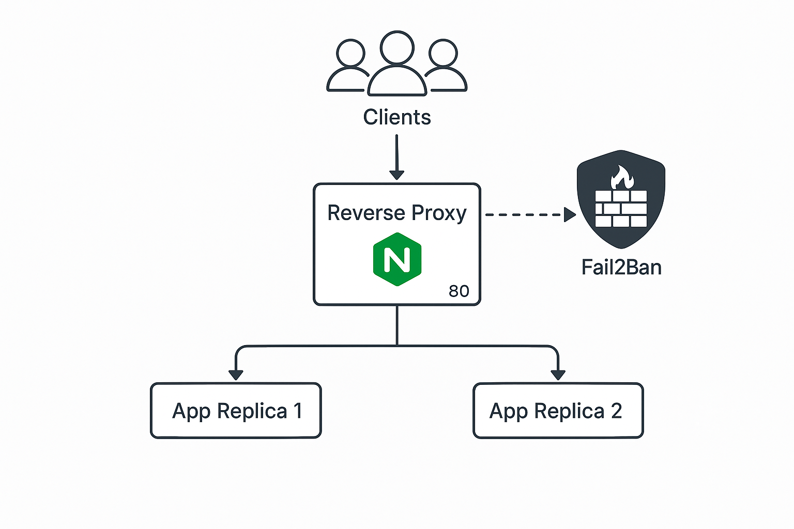

# Cours Pentest Docker Dynamique : Sécurisation et Exploitation Avancées
## Context
Ce module de cybersécurité se déroule dans un laboratoire Docker équipé d’un load balancer. À travers une série de scénarios d’attaque réalistes, les apprenants doivent identifier les menaces, configurer les défenses appropriées et valider leur efficacité.
L’objectif pédagogique est double :

Optimiser la productivité en cybersécurité grâce à des environnements logiques, dynamiques et entièrement reproductibles (Infrastructure as Code).

Standardiser et automatiser les tests de sécurité, tout en favorisant la collaboration : chaque expert peut ajouter ses propres workflows et partager ses bonnes pratiques via un dépôt Git commun.

## Introduction 
Cette section avancée vise à apprendre aux experts en cybersécurité à évaluer rapidement un environnement **Docker** avec **équilibrage de charge** du point de vue de la sécurité. Il s’agit d’identifier et documenter les vulnérabilités de l’infrastructure, d’associer les failles à des références (CVE, CWE) et de mettre en pratique des exploits connus. L’objectif est de démontrer la capacité à réaliser une **analyse de vulnérabilités** rapide et efficace, en utilisant des outils de pentest (ex: **Nmap**, **Metasploit**, etc.) et en s’appuyant sur des cas concrets. 

# Infrastructure as Code: Environnement collaboratif pour Tests de Sécurité

## Introduction

L'approche Infrastructure as Code (IaC) change notre la façon dont nous conduisons les tests de sécurité. En définissant des environnements Docker reproductibles, nous créons une plateforme collaborative où chaque expert peut contribuer en ajoutant ses propres scénarios de test et workflows d'exploitation.

## Conception de l'environnement IaC

### Load Balancer

En informatique, la répartition de charge (en anglais : load balancing) désigne le processus de répartition d’un ensemble de tâches sur un ensemble de ressources, dans le but d’en rendre le traitement global plus efficace. [Wiki]([https://fr.wikipedia.org/wiki/R%C3%A9partition_de_charge])

### Load Balancing algorithme

| **Algorithme** | **Couche OSI** | **Logique de distribution** | **Comportement sous forte charge / attaque** | **Coût CPU LB** |
| --- | --- | --- | --- | --- |
| **Round Robin** | L4 / L7 | Tourniquet simple`srv1 → srv2 → …` | Risque de surcharger un nœud plus lent ; pas de mitigation DDoS | Très faible |
| **Weighted Round Robin** | L4 / L7 | RR + poids statiques (`w=5,1…`) | Weights obsolètes → déséquilibre | Faible |
| **Least Connections** | L4 / L7 | Envoie au serveur le moins connecté | Connexions idle → "fantômes" | Moyen |
| **Weighted Least Connections** | L4 / L7 | LC pondéré par capacité | Poids mal ajustés → biais | Moyen | 
| **IP Hash / Consistent Hash** | L7 | Hachage IP / cookie ⇒ même nœud | Perte d'un nœud → re-hash massif, perte de session | Faible |
| **EWMA / Dynamic-RR (HAProxy)** | L7 | Pondère selon latence récente | Réallocation automatique ; absorbe flash-crowd | Plus élevé |

### Lab: scenario d'attaque en environement encadrer

Nous avons donc mis en place un scénario reflète notre environnement de production : un serveur Nginx utilisé comme load balancer pour les réplicas de notre application. Juste à côté, un service Fail2Ban surveille en quasi temps réel les logs générés, constituant ainsi une première ligne de défense contre les menaces potentielles. [IAC Infra](./docker-compose.yml)

## Votre environnement

| Domaine | Composants / Outils | Rôle principal |
| --- | --- | --- |
| **Architecture de base** | **Docker Compose** | Orchestration des conteneurs et réseau interne |
|  | **Nginx (LB)** | Répartition du trafic HTTP/HTTPS vers vos applications |
|  | **Conteneurs is “Load Balancer Targets” with dyn conf**  | Surface d’attaque pour scénarios de pentest |
|  | **Scripts d’automatisation** (Bash/Ansible) | Déploiement, scale |
| **Workflows automatisés** | **Pipeline CI/CD** | Build, lint, déploiement d’environnements IaC |
|  | **Tests de sécurité** (OWASP ZAP, Trivy, scripts custom) | Scans SAST/DAST, exploitation automatique |
|  | **Collecte & analyse** (Prometheus, Grafana, Loki) | Agrégation logs/metrics, tableaux de bord, alertes |

## Attaques automatisées

Exemple: les objectifs, différents selon chaque sujet, seront enrichis progressivement par les contributeurs.

| ID | Algorithme visé | Script (/attacks/) | Payload | Objectif | État |
| --- | --- | --- | --- | --- | --- |
| A-RR-01 | Round Robin | rr_flood.sh | 20 000 req/s GET /?slow=1 | Montrer qu’un seul nœud sature → erreurs 5xx | ⏳ |
| A-WRR-02 | Weighted RR | weight_bias.sh | Ratio trafic 1:1 malgré weight 5:1 | Vérifier qu’un mauvais poids crée le déséquilibre | ⏳ |
| A-LC-03 | Least Conn. | long_websocket.py | 500 connexions WebSocket longues | Encombrer un nœud ; observer la bascule | ⏳ |
| A-EWMA-04 | EWMA | latency_spike.sh | Latence variable (tc qdisc) | Observer la réallocation auto vers les nœuds rapides | ⏳ |

## Identification des vulnérabilités de l’environnement 
Avant toute exploitation, un expert doit **cartographier** les composants du système Docker et du load balancer, puis identifier les vulnérabilités potentielles. Voici les étapes recommandées :

- **Scan réseau et découverte de services :** Utilisez `nmap` pour détecter les ports ouverts sur le load balancer et les conteneurs hébergés ([Nmap: the Network Mapper - Free Security Scanner](https://nmap.org/#:~:text=Nmap%3A%20the%20Network%20Mapper%20,network%20discovery%20and%20security%20auditing)). Par exemple, un simple scan (`nmap -sV <adresse>` avec détection de version) permet de recenser les services (serveur web Nginx/Apache, API Docker, etc.) et leurs versions. Les scripts NSE de Nmap peuvent ensuite être employés pour détecter des vulnérabilités connues sur ces services (par ex. `http-vuln-*` pour les failles web). Nmap est un outil gratuit largement utilisé en audit de sécurité pour la **découverte réseau et l’audit de sécurité** ([Nmap: the Network Mapper - Free Security Scanner](https://nmap.org/#:~:text=Nmap%3A%20the%20Network%20Mapper%20,network%20discovery%20and%20security%20auditing)).

- **Inspection de la configuration Docker et du load balancer :** Analysez les fichiers de configuration (Docker Compose, Dockerfiles, config du proxy/lb) à la recherche de paramètres sensibles. Par exemple, vérifier si le démon Docker expose une socket TCP non sécurisée (port 2375) ou si des conteneurs sont lancés en mode privilégié. Des outils comme **Docker Bench Security** (script d’audit automatisé de Docker) peuvent aider à évaluer la configuration par rapport aux bonnes pratiques (CIS Benchmark). De même, contrôlez la configuration du load balancer (ex : **HAProxy**, **Nginx**, etc.) pour repérer des **interfaces d’administration ouvertes**, l’usage de mots de passe par défaut, ou des règles trop permissives.

- **Analyse des images et dépendances :** Utilisez un scanner de vulnérabilités des images Docker tel que **Trivy** ou **Docker Scout** (`docker scout cves`) pour lister les CVE présentes dans les conteneurs (systèmes et bibliothèques) ([docker scout cves - Docker Docs](https://docs.docker.com/reference/cli/docker/scout/cves/#:~:text=docker%20scout%20cves%20,recently%20built%20image%20is%20used)). Cela permet d’identifier rapidement si un conteneur utilise une version vulnérable (exemple : OpenSSL Heartbleed, bibliothèque log4j vulnérable, etc.). On peut également consulter des bases publiques comme **CVE Details** pour voir l’historique des CVE sur un composant donné (ex: la page CVE Details de Docker liste toutes les vulnérabilités connues du moteur Docker ([Docker Docker security vulnerabilities, CVEs, versions and CVE ...](https://www.cvedetails.com/product/28125/Docker-Docker.html?vendor_id=13534#:~:text=,for%20security%20vulnerabilities%20of))). Chaque vulnérabilité devrait être documentée avec son identifiant CVE et une description de l’impact.

- **Outils de scan de vulnérabilités :** En complément, un scan avec un outil dédié (OpenVAS, Nessus, ou Nikto pour le web) peut automatiser la détection de failles connues. Par exemple, **Nikto** peut tester les serveurs web des conteneurs derrière le load balancer pour détecter des fichiers sensibles ou failles courantes. Les résultats de ces scans pourront être importés dans Metasploit pour identifier les modules d’exploit correspondants ([Metasploit - Wikipedia](https://en.wikipedia.org/wiki/Metasploit#:~:text=match%20at%20L252%20fingerprinting%20tools,10)).

*Remarque :* Bien documenter chaque découverte dans un rapport intermédiaire – par exemple « Service Nginx 1.18 détecté – possiblement vulnérable à CVE-2019-20372 (overflow) » ou « Port 2375 ouvert – risque de contrôle Docker non authentifié (CWE-284 Improper Access Control) ([CWE 284 Improper Access Control - CVE Details](https://www.cvedetails.com/cwe-details/284/Improper-Access-Control.html#:~:text=CWE%20284%20Improper%20Access%20Control,07)) ». Cette phase de reconnaissance établit la liste des cibles d’exploitation pour la suite.

## Vulnérabilités courantes et références CVE/CWE associées 
Dans un environnement Docker avec load balancing, plusieurs catégories de vulnérabilités peuvent être présentes. Pour chaque catégorie, nous listons des failles connues avec leur identifiant CVE (lorsque disponible) ou un identifiant de faiblesse CWE, afin de faciliter les recherches et références :

- **1) Failles du moteur Docker et échappements de conteneur :** Ce sont des vulnérabilités permettant à un attaquant présent dans un conteneur de s’échapper vers l’hôte (breakout). Par exemple, **CVE-2019-5736** (vulnérabilité de runc) affecte les Docker *containers* par défaut et permet d’obtenir un accès root sur l’hôte depuis le conteneur ([Breaking out of Docker via runC – Explaining CVE-2019-5736](https://unit42.paloaltonetworks.com/breaking-docker-via-runc-explaining-cve-2019-5736/#:~:text=Last%20week%20%282019,and%20new%20versions%20were%20released)). Cette faille exploitait une mauvaise gestion des descripteurs de fichier dans runc pour écraser un binaire sur l’hôte ([CVE-2019-5736 - Vulnerable Docker runc Service](https://www.ncsc.gov.ie/emailsfrom/Shadowserver/CVE/CVE-2019-5736/#:~:text=CVE,descriptor%20mishandling%2C%C2%A0related%20to%20%2Fproc%2Fself%2Fexe)). Plus récemment, en **2022**, une vulnérabilité du noyau Linux (**CVE-2022-0185**) a été identifiée, permettant à un utilisateur non-privilégié d’obtenir root en conteneur (capability *CAP_SYS_ADMIN* requise) ([CVE-2022-0185 in Linux Kernel Can Allow Container Escape in Kubernetes](https://www.aquasec.com/blog/cve-2022-0185-linux-kernel-container-escape-in-kubernetes/#:~:text=This%20vulnerability%20provides%20an%20opportunity,attacker%20could%20exploit%20this%20issue)). De même **CVE-2022-0492** (faille cgroups) a permis de **contourner l’isolation** et d’exécuter du code sur l’hôte depuis un conteneur ([Understanding docker container escapes: risks and prevention](https://www.byteplus.com/en/topic/556785#:~:text=Understanding%20docker%20container%20escapes%3A%20risks,Shocker%20exploit%20%282014%29%3A)). En 2024, la recherche "Leaky Vessels" a révélé plusieurs nouvelles failles d’évasion de conteneur (ex: **CVE-2024-21626** lié à runc, ou des failles dans BuildKit) permettant de quitter le conteneur et accéder au système hôte ([Leaky Vessels : des vulnérabilités de Docker et runc permettant de s’évader des conteneurs - Janvier 2024 | Snyk](https://snyk.io/fr/blog/leaky-vessels-docker-runc-container-breakout-vulnerabilities/#:~:text=d%C3%A9couverte%20d%E2%80%99une%20vuln%C3%A9rabilit%C3%A9%20%28CVE,31%C2%A0janvier%C2%A02024%20%C3%A0%20environ%2015%C2%A0h%20EST)). *(CWE associé : **CWE-269 Improper Privilege Management**, reflétant une élévation de privilège imprévue vers l’hôte ([CWE 269 Improper Privilege Management - CVE Details](https://www.cvedetails.com/cwe-details/269/Improper-Privilege-Management.html#:~:text=CWE%20269%20Improper%20Privilege%20Management,creating%20an%20unintended%20sphere)).)*

- **2) Mauvaises configurations et erreurs de sécurité Docker :** Au-delà des failles logicielles, de nombreuses vulnérabilités proviennent de configurations faibles. Par exemple, exposer l’API Docker Socket sans protection (port 2375 non sécurisé) est une grave faille d’accès non autorisé (**CWE-284 : Improper Access Control**) – un attaquant distant pourrait lancer des conteneurs malveillants sur l’hôte ([Rapid7 Vulnerability Database](https://www.rapid7.com/db/modules/exploit/linux/http/docker_daemon_tcp/#:~:text=Utilizing%20Docker%20via%20unprotected%20tcp,path%20of%20the%20host%20server)). De même, exécuter des conteneurs avec des privilèges excessifs (flag `--privileged` ou `--cap-add=ALL`) ouvre la porte à des contournements de l’isolation. Un conteneur démarré en mode privilégié peut souvent accéder à l’hôte via des techniques connues (cf. exploit *cgroup notify_on_release* ci-dessous). L’absence de limitations de ressources ou de profil de sécurité (AppArmor, Seccomp) est également classée comme faiblesse, car elle facilite l’exploitation de failles du kernel. *(CWE associés : **CWE-250** Exécution avec des privilèges superflus, **CWE-284** Contrôle d’accès incorrect.)* 

- **3) Vulnérabilités du load balancer (serveurs proxy) :** Les logiciels d’équilibrage (HAProxy, Nginx, Apache httpd en mode proxy) peuvent eux-mêmes contenir des failles. Par exemple, HAProxy a connu une vulnérabilité de **HTTP Request Smuggling** (détournement de requête HTTP) en 2023-2024 ([CVE -
Search Results
](https://cve.mitre.org/cgi-bin/cvekey.cgi?keyword=HAProxy#:~:text=configurations%2C%20has%20a%20sample_conv_regsub%20heap,RTT%20session%20with%20a)). Cette attaque (CWE-444) permet à un attaquant d’insérer des requêtes pièges qui contournent les règles du proxy, possiblement pour atteindre des URL internes non autorisées ([CVE -
Search Results
](https://cve.mitre.org/cgi-bin/cvekey.cgi?keyword=HAProxy#:~:text=CVE,the%20IP%20allow%2Fblock%20list%20functionality)). D’autres failles peuvent inclure des dépassements de mémoire tampon (ex: CVE-2018-20150 sur HAProxy) ou des contournements d’ACL. Côté Nginx, bien que rare, on peut citer **CVE-2013-2028** (ancien débordement de tampon dans Nginx, RCE) ou plus récemment des failles dans certains modules tiers. Il faut aussi considérer les interfaces d’administration : par exemple **Roxy-WI** (console web pour HAProxy/Nginx) a eu une injection de commande critique en 2024 ([CVE -
Search Results
](https://cve.mitre.org/cgi-bin/cvekey.cgi?keyword=HAProxy#:~:text=CVE,Then)). *(CWE associés : **CWE-119** pour les débordements mémoire, **CWE-352** pour le contournement d’ACL, etc., selon la vulnérabilité spécifique.)* L’identification de ces failles passe par la surveillance des CVE des composants d’infrastructure réseau.

- **4) Vulnérabilités au sein des conteneurs (applications) :** Chaque service applicatif tournant dans un conteneur peut avoir ses propres failles. Par exemple, une application web derrière le load balancer pourrait subir une injection SQL, une exécution de code à distance (RCE) ou autre faille applicative (OWASP Top 10). Bien que ces failles applicatives ne soient pas propres à Docker, leur exploitation initiale peut fournir un point d’entrée dans l’environnement containerisé. Il convient donc de lister aussi les CVE relatives aux applications hébergées (ex: CVE d’un CMS vulnérable, d’une version de framework, etc.). *CWE associés : variés (ex: CWE-89 Injection SQL, CWE-79 XSS, CWE-787 Overflow, etc.)*. **Exemple :** un conteneur Apache Struts vulnérable à **CVE-2017-5638** (RCE) derrière un load balancer pourrait être compromis à distance, puis servir de pivot pour attaquer l’infrastructure Docker.

En résumé, cette étape aboutit à une **liste priorisée de vulnérabilités** avec pour chacune : description, gravité, identifiant CVE ou catégorie CWE, composant affecté, et prérequis d’exploitation (présence d’un certain accès, d’un certain réglage, etc.).

## Exploitation des failles et preuves de concept 
Une fois les vulnérabilités identifiées, l’expert doit tenter de les exploiter afin de **démontrer concrètement les risques**. Cette partie du cours présente des exemples d’exploitation et les outils utiles pour y parvenir, toujours dans un cadre contrôlé (environnement de test ou lab). 

- **Choix des outils d’exploitation :** L’outil principal recommandé est **Metasploit Framework**, un cadre d’exploitation modulaire très utilisé en pentest ([Metasploit: Penetration Testing Software - Rapid7](https://www.rapid7.com/products/metasploit/#:~:text=Metasploit%3A%20Penetration%20Testing%20Software%20,right%20risks%2C%20and%20improve%20security)). Metasploit contient de nombreux modules pour exploiter des CVE connues ou des configurations faibles. Par exemple, il existe un module pour exploiter une **socket Docker non protégée** (`exploit/linux/http/docker_daemon_tcp`) qui permet de créer un conteneur malveillant et d’écrire sur l’hôte via le montage du système de fichiers racine ([Rapid7 Vulnerability Database](https://www.rapid7.com/db/modules/exploit/linux/http/docker_daemon_tcp/#:~:text=Utilizing%20Docker%20via%20unprotected%20tcp,path%20of%20the%20host%20server)). Un autre module `docker_privileged_container_escape` cible spécifiquement l’évasion depuis un conteneur Docker lancé avec `--privileged` ou `--cap-add=SYS_ADMIN` ([Rapid7 Vulnerability Database](https://www.rapid7.com/db/modules/exploit/linux/local/docker_privileged_container_escape/#:~:text=Description)). Metasploit facilite l’obtention de shells reverse, l’élévation de privilèges et l’exécution de payloads sur la cible compromise. Outre Metasploit, **SearchSploit** (base Exploit-DB en local) est utile pour trouver rapidement un code d’exploitation public correspondant à une CVE donnée. Par exemple, on peut rechercher `searchsploit CVE-2022-0492` pour trouver un exploit de cette faille cgroups s’il existe. De plus, de nombreux PoC (Proof of Concept) sont disponibles sur GitHub pour les CVE récentes – le formateur encouragera à consulter ces référentiels publics (en veillant à leur fiabilité) afin de tester manuellement certaines failles hors Metasploit.

- **Exemples concrets d’exploitation :** Pour illustrer, on peut présenter plusieurs démonstrations types :
  - *Exploitation d’une API Docker exposée:* en utilisant Metasploit ou curl, monter une attaque où l’on crée un conteneur sur l’hôte via l’API non authentifiée. **PoC :** la payload crée un job cron malveillant sur l’hôte en montant `/-v /:/mnt` puis en écrivant dans `/mnt/etc/cron.d` ([Rapid7 Vulnerability Database](https://www.rapid7.com/db/modules/exploit/linux/http/docker_daemon_tcp/#:~:text=Utilizing%20Docker%20via%20unprotected%20tcp,path%20of%20the%20host%20server)). Cette démonstration montre qu’une simple exposition réseau de Docker équivaut à une compromission totale du serveur Docker.
  - *Exploitation d’une application dans un conteneur suivi d’un pivot :* par exemple, un conteneur web vulnérable (ex: **CVE-2017-5638 Apache Struts**). **PoC :** lancer l’exploit (module Metasploit exploit/multi/http/struts_dmi_exec par ex.) pour obtenir un shell dans le conteneur. Ensuite, du point de vue post-exploitation, chercher des moyens de passer du conteneur à l’hôte : surveiller si le socket Docker `/var/run/docker.sock` est présent dans le conteneur (cas fréquent si le conteneur appartient à un orchestrateur ou outil de monitoring). Si oui, l’exploiter (outils *docker* en ligne de commande dans le conteneur peuvent permettre de lancer un conteneur privilégié sur l’hôte, ou de monter des volumes de l’hôte). Sinon, tenter une escalade locale : par exemple utiliser un exploit kernel récent comme **Dirty Pipe (CVE-2022-0847)** pour devenir root dans le conteneur, puis utiliser ce privilège pour accéder à une ressource partagée de l’hôte (si un volume de l’hôte est monté dans le conteneur, écrire dedans). Cet exemple complet montre la chaîne d’attaque depuis la faille applicative jusqu’à la compromission de l’infrastructure.

- **Conseils et bonnes pratiques lors des exploits :** Toujours vérifier la stabilité du système lors de tests d’exploitation (certains exploits peuvent crasher un service). Prioriser les exploits **à faible impact** d’abord (ex: lecture de fichier sensible) avant d’essayer un RCE potentiellement déstabilisant. Documenter chaque étape de l’exploitation avec des captures (screenshots de la session Metasploit, etc.) pour le rapport final de l’expertise. Enfin, comparer les failles exploitées avec les correctifs disponibles afin de recommander les mesures de mitigation (ex: mise à jour logicielle, durcissement de la config Docker ou du LB, principes *least privilege*, etc.).

## Post-exploitation et élévation de privilèges 
Dans un scénario réel, compromettre un service ou un conteneur n’est souvent que le point de départ. L’expert doit ensuite effectuer la **post-exploitation** : maintenir l’accès, explorer l’environnement interne, et tenter d’étendre son contrôle (élévation de privilèges horizontale ou verticale).

- **Escalade de privilèges au sein du conteneur :** Si l’accès initial se fait avec un compte non privilégié dans un conteneur (cas d’un service tournant en utilisateur limité), il faut chercher à devenir root dans le conteneur. Des scripts d’automatisation comme **LinPEAS** ou **Linux Exploit Suggester** peuvent être copiés et exécutés dans le conteneur pour détecter des failles locales (kernel vulnérable, SUID binaries, etc.). Par exemple, LinPEAS peut repérer si le noyau Linux de l’hôte est vulnérable à **DirtyPipe (CVE-2022-0847)** ou **Sequoia (CVE-2021-33909)**, offrant une opportunité d’escalade. L’exploitation d’une de ces failles depuis le conteneur rendra l’attaquant *root* (toujours à l’intérieur du conteneur) ([CVE-2022-0185 in Linux Kernel Can Allow Container Escape in Kubernetes](https://www.aquasec.com/blog/cve-2022-0185-linux-kernel-container-escape-in-kubernetes/#:~:text=This%20vulnerability%20provides%20an%20opportunity,attacker%20could%20exploit%20this%20issue)). À partir de là, de nouvelles possibilités s’ouvrent : extraction de secrets (fichiers de config avec mots de passe, variables d’environnement, tokens d’API) ou préparation d’une évasion vers le système hôte.

- **Évasion du conteneur vers l’hôte :** Plusieurs techniques peuvent permettre de sortir d’un conteneur une fois qu’on a un contrôle élevé. Si le conteneur est mal isolé (privilégié ou avec des volumes host sensibles montés), l’attaquant root dans le conteneur l’est aussi sur l’hôte. Par exemple, si `/var/run/docker.sock` est monté dans le conteneur (pratique répandue pour administrer Docker), il suffit d’exécuter des commandes Docker à l’intérieur pour contrôler l’hôte (l’API Docker étant exposée localement) – c’est un cas d’école d’**erreur de configuration critique**. S’il n’y a pas de faille évidente, l’attaquant peut tenter des exploits d’évasion *zero-day* (si disponibles) ou des failles kernel connues non corrigées sur l’hôte. Rappelons **CVE-2019-5736** : un exploit public (en Go) de cette faille permettait à un processus dans un conteneur d’écraser le binaire runc de l’hôte et d’exécuter du code avec privilèges root ([Breaking out of Docker via runC – Explaining CVE-2019-5736](https://unit42.paloaltonetworks.com/breaking-docker-via-runc-explaining-cve-2019-5736/#:~:text=Last%20week%20%282019,and%20new%20versions%20were%20released)) ([Breaking out of Docker via runC – Explaining CVE-2019-5736](https://unit42.paloaltonetworks.com/breaking-docker-via-runc-explaining-cve-2019-5736/#:~:text=Initially%2C%20the%20official%20exploit%20code,was%20out%20of%20the%20bag%E2%80%9D)). Un expert doit être capable de tester ce genre d’exploit en environnement isolé pour vérifier si l’hôte est vulnérable (version Docker/runc non patchée). Autre exemple, l’attaque par détournement de cgroup (**CVE-2022-0492**) évoquée plus haut : même sans module Metasploit, il est possible d’écrire un petit script qui crée un nouveau cgroup et définit un release_agent malveillant (shell sur l’hôte) ([Understanding Docker container escapes - The Trail of Bits Blog](https://blog.trailofbits.com/2019/07/19/understanding-docker-container-escapes/#:~:text=cgroup,privileged%20root%20on%20the%20host)) – démontrant ainsi l’impact d’un conteneur qui n’aurait pas de restrictions suffisantes. 

- **Mouvement latéral et persistance :** Une fois l’hôte Docker compromis, l’attaquant peut accéder aux autres conteneurs ou à d’autres machines. Dans un cluster avec équilibrage de charge, il peut par exemple intercepter le trafic du load balancer (sniffing s’il est sur le même réseau) ou reconfigurer le proxy pour rediriger vers un serveur sous son contrôle. Pour la persistance, on peut déployer un *implant* sur l’hôte, par ex. ajouter une *backdoor* dans une image Docker utilisée (ainsi chaque nouveau conteneur aura la porte dérobée), ou modifier la configuration du système hôte (ajout d’une clé SSH dans /root/.ssh/authorized_keys via l’accès root obtenu). Ces techniques doivent être mentionnées pour sensibiliser aux conséquences d’une compromission : **sans remédiation complète, un attaquant pourrait réinfecter l’environnement même après un redémarrage**.

En somme, la post-exploitation en environnement Docker nécessite à la fois des compétences Linux (élévation locale) et une compréhension de Docker pour détourner les mécanismes propres aux conteneurs. Il faut souligner l’importance de pratiques de défense (principes de sécurité Docker : ne pas exposer la socket Docker, ne pas utiliser `--privileged` sans nécessité, appliquer les patchs de sécurité kernel/Docker rapidement, etc.) pour empêcher ces escalades.

## Cas pratiques et exercices recommandés 
Pour ancrer ces connaissances, la section se termine par des **cas pratiques** que les apprenants pourront reproduire. L’idée est de mettre en œuvre une expertise sur une infrastructure Docker vulnérable en un temps limité.

- **Lab 1 – Vulnérabilités Docker connues (Vulhub) :** Utilisation de **Vulhub**, un projet open-source fournissant des environnements Docker vulnérables pré-configurés ([Vulhub - Open-Source Vulnerable Docker Environments](https://vulhub.org/#:~:text=Vulhub%20is%20an%20open,for%20security%20researchers%20and%20educators)). Par exemple, déployer l’environnement `docker/CVE-2019-5736` ou un scénario Web vulnérable. Les apprenants devront scanner, identifier la faille CVE en question, l’exploiter (en utilisant éventuellement le POC disponible ou Metasploit), puis proposer un correctif. *Vulhub* documente chaque vulnérabilité avec le contexte et les étapes d’exploitation, ce qui en fait un excellent terrain d’entraînement ([Vulhub - Open-Source Vulnerable Docker Environments](https://vulhub.org/#:~:text=Real%20Vulnerabilities)).

Pour chacun de ces cas pratiques, fournir des **guides de correction** ou des indices sous forme de liens. Par exemple, après le Lab 2, pointer vers un article ou un write-up public d’un cas similaire. Encourager l’utilisation des outils vus en cours (Nmap, Metasploit, etc.) dans ces exercices pour bien maîtriser leur usage en situation réelle.

## Ressources complémentaires 
Pour approfondir cette thématique de sécurité des conteneurs et de l’équilibrage de charge, on recommande les ressources suivantes :

## Exemple
- **Documentation officielle Docker – Sécurité :** <small>(Docker docs sur le durcissement, options de sécurité AppArmor/SELinux, etc.)</small> – *(lien : Docker Security documentation)*. Cette doc couvre les meilleures pratiques pour sécuriser lDaemon Docker et les conteneurs (par ex., ne pas lancer de conteneurs en root, mettre à jour régulièrement, configurer un firewall sur l’API Docker).  
- **Base de données CVE et CWE :** Le site du Mitre et CVE Details pour rechercher des détails sur des vulnérabilités ou des catégories de faiblesses. Par ex., la page **CWE-284 Improper Access Control** explique le concept de ressources non protégées ([CWE 284 Improper Access Control - CVE Details](https://www.cvedetails.com/cwe-details/284/Improper-Access-Control.html#:~:text=CWE%20284%20Improper%20Access%20Control,07)). Le site NVD (nvd.nist.gov) fournit les scores CVSS et détails techniques pour chaque CVE.

En synthèse, cette section avancée donnera aux apprenants une **méthodologie d’audit de sécurité** pour les infrastructures Docker avec load balancing, ainsi que les outils et références pour rester à jour sur les menaces. La combinaison de notions théoriques (CVE/CWE) et de **mises en pratique concrètes** assurera qu’à l’issue, les experts sauront identifier rapidement les points faibles d’un tel environnement et démontrer, exploits à l’appui, l’importance de les sécuriser.

## Contribution de Scénarios de Test

Cette section est enrichie progressivement par les collaborateurs du projet. Chaque nouveau scénario doit inclure :

- Une description détaillée du workflow
- Les prérequis techniques
- Les objectifs de sécurité visés
- Les métriques de succès

<aside>
Pour ajouter un nouveau scénario, créez une branche git et suivez le template de documentation fourni dans /docs/scenarios/

</aside>

- Exemple de contribution

    Workflow : Détection d'injection SQL via proxy inversé

    - Auteur : @pentester_alice
    - Date : 2025-04-20
    - Description : Test automatisé d'injections SQL à travers un load balancer
    - Fichiers : /scenarios/sql-injection-lb/

## Bibliothèque d'Exploits Collaborative

Les scripts et outils d'exploitation sont maintenus collectivement par l'équipe. Votre a realiser sur une cible LB sur l'algo de votre choix (least connection, ....). Pour contribuer :

- Processus de contribution
    - Forker le dépôt principal
    - Ajouter votre exploit dans ./scripts/exploits/
    - Choisir un algorithme de loadbalancing a exploiter
    - Faites une analyse cyber sur les cve/vwe et exploit lié a votre cible (LB RR: CVE ...) 
    - Trouver un scenario qui vous convient et concretisez le techniquement 
    - Documenter votre ou vos scenario
    - Créer une pull request
- Standards de qualité
    - Tests unitaires requis
    - Documentation complète
    - Respect des bonnes pratiques

## Amélioration continue

- Feedback et itération

    Le système permet de :

    - Collecter des métriques sur les tests
    - Identifier les goulots d'étranglement
    - Optimiser les workflows
    - Intégrer de nouveaux scénarios
- Documentation et partage
    - Création de templates réutilisables
    - Base de connaissances des exploits
    - Bibliothèque de workflows

## Ressources et outils

- Infrastructure
    - Docker et Docker Compose
    - Ansible pour le provisionnement
    - GitLab CI pour l'automatisation
- Sécurité
    - Metasploit Framework
    - Scripts d'exploitation personnalisés
    - Outils d'analyse automatisée
